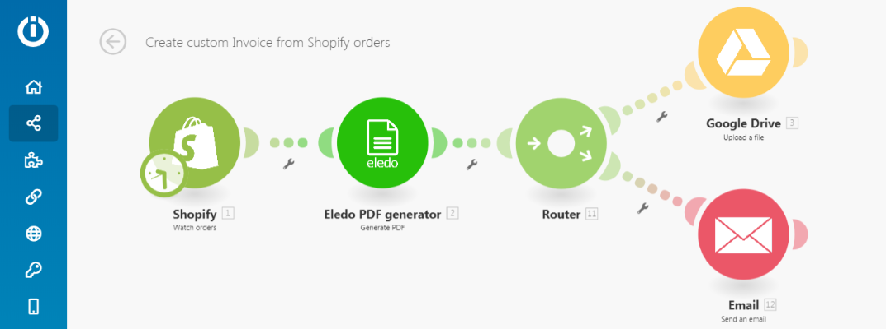
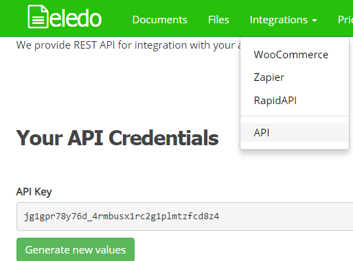
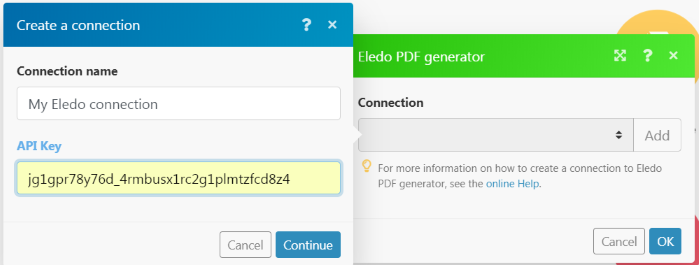
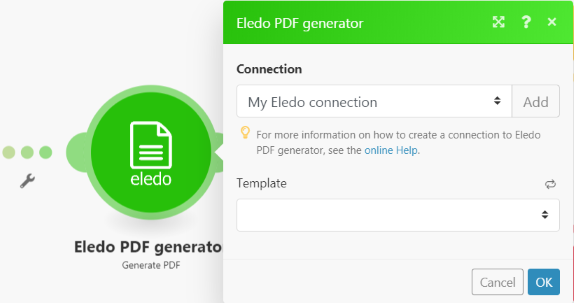
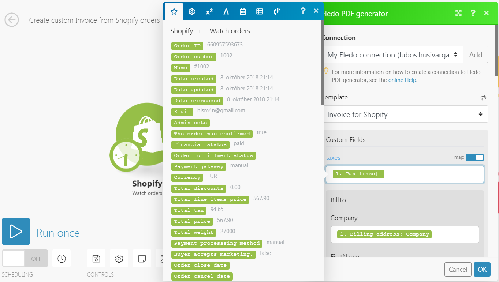
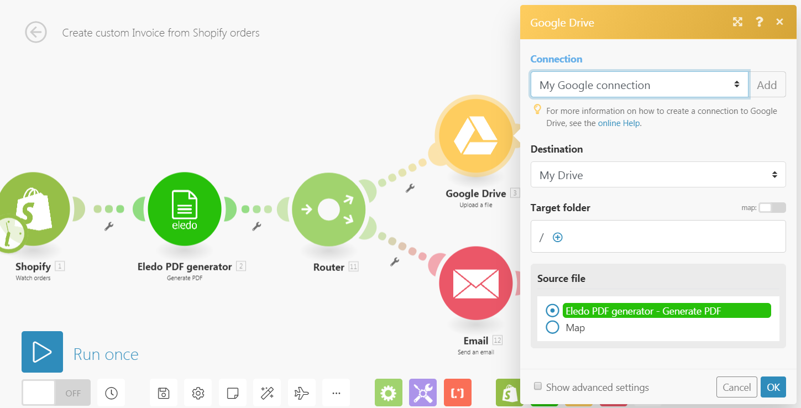

Make is a powerful online tool that connects online services and combines them into automated flows with full control. It makes it very easy to automate everyday business tasks.

{/* truncate */}

Documents are usually part of these workflows. They are used for communication between businesses and clients, so they are very important. Every successful business uses personalized and well-designed documents to impress partners or clients.

This is where **Eledo** becomes useful. It makes **document automation and personalization simple for everyone**.

---

## Let's Automate Something

Sign up for **Eledo** and **Make** services. This is required because you need to create your own scenario in Make and a document template in Eledo.

Don't worry — both services offer **freemium accounts**.

In this article we will describe the role of **Eledo** inside an **Make scenario** for generating personalized **PDF invoices for Shopify orders**.

Eledo is also building a **public document library** that allows you to start quickly with common document types and personalize them later.

---

## Connecting Make and Eledo

You can find the **Eledo PDF Generator** module directly in the Make module list. However, to activate it you need to create your personal connection.

Find your **API Key** in the Eledo dashboard under:

**Integrations → API**

Create a new connection in Make and paste your API Key.

Keep this key **private** and do not share it with others, otherwise they could use your quota or templates. You can generate a new API Key anytime if needed.

Press **Continue** to validate and save the connection.

Next, choose a document template. If you haven't created one yet, you can use a **public template** for testing.

We provide a ready-to-use **Invoice for Shopify** template for quick setup.

---

## Data Mapping

Eledo automatically prepares the **web form and API structure** for your document template.

Once your template is saved and activated, you can immediately load the new fields in Make and start mapping your data to generate the PDF.

Invoices are complex documents with many values to transfer, so mapping takes some time to configure properly.

Templates often include **line items**, which makes this scenario a good example of how **Make and Eledo can handle structured data together**.

---

## Here Comes the PDF

The output from the Eledo module is a **binary PDF file** that you can use however you like.

Document generation happens **on the fly**, and transaction data is **not stored in the Eledo cloud by default**, because we respect your privacy.

What can you do with the generated document?

You can:

- save it to a file storage
- attach it to an email
- upload it to another service

With Make, there are practically **no limits**.

For example, uploading to **Google Drive** is very simple.

The file name is defined in the Eledo template, and it can be **dynamic**.

Eledo also supports **document counters**, allowing you to generate unique document numbers automatically.

Sending the document as an **email attachment** works in a similar way.

Notice how the **file name is used in the email subject**.

In this example, the invoice file name looks like:
