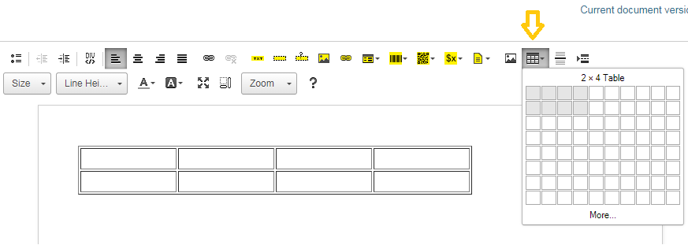
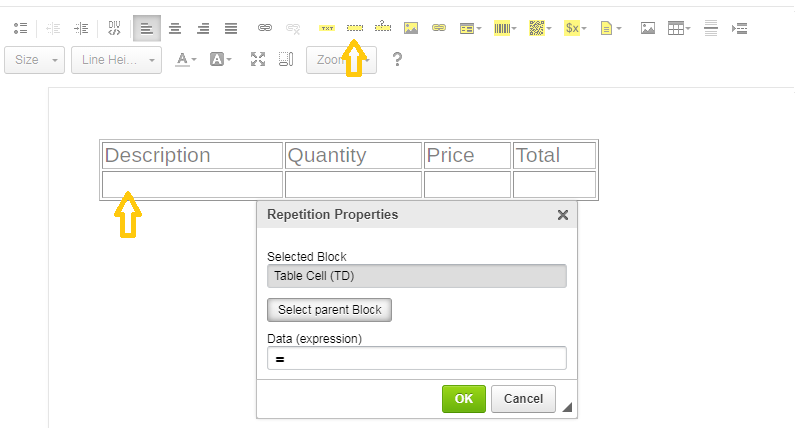
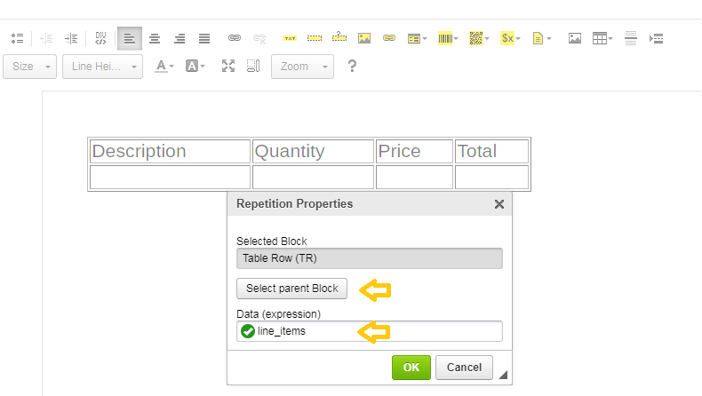
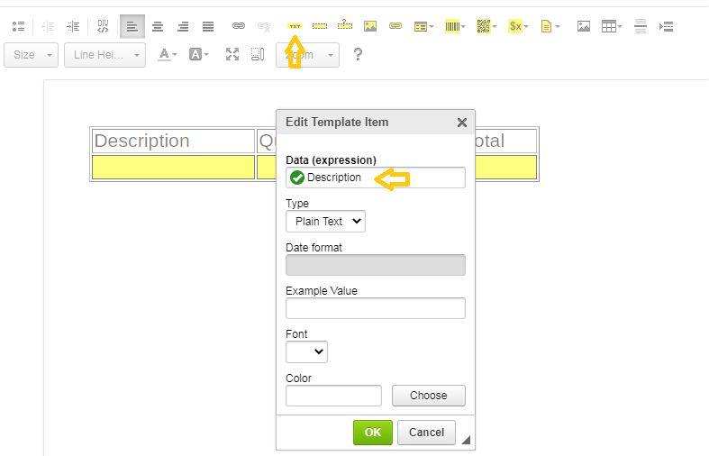
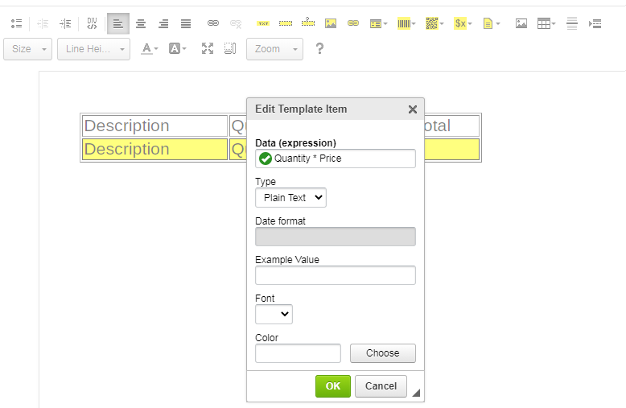
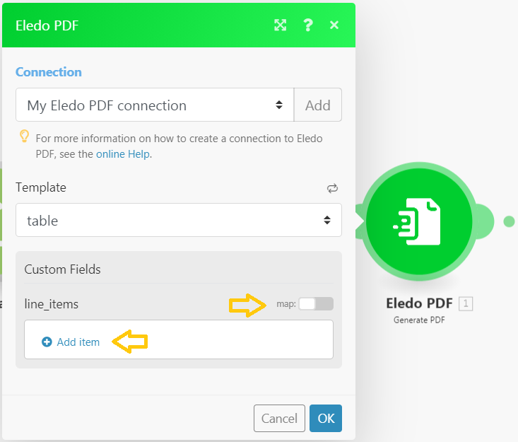
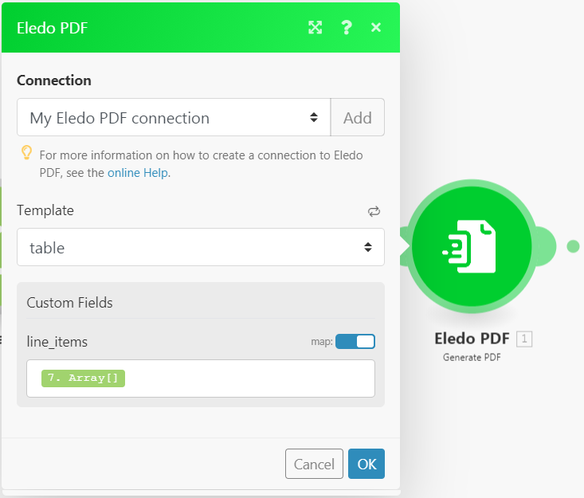
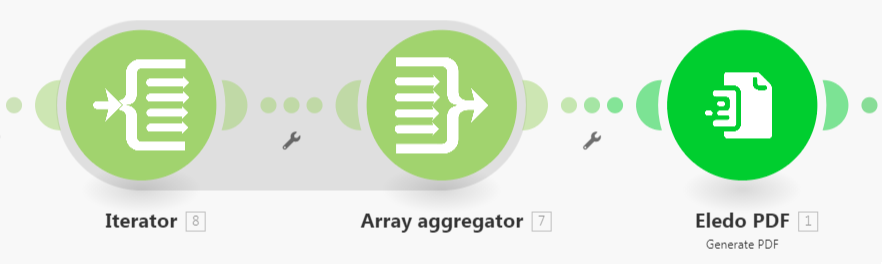
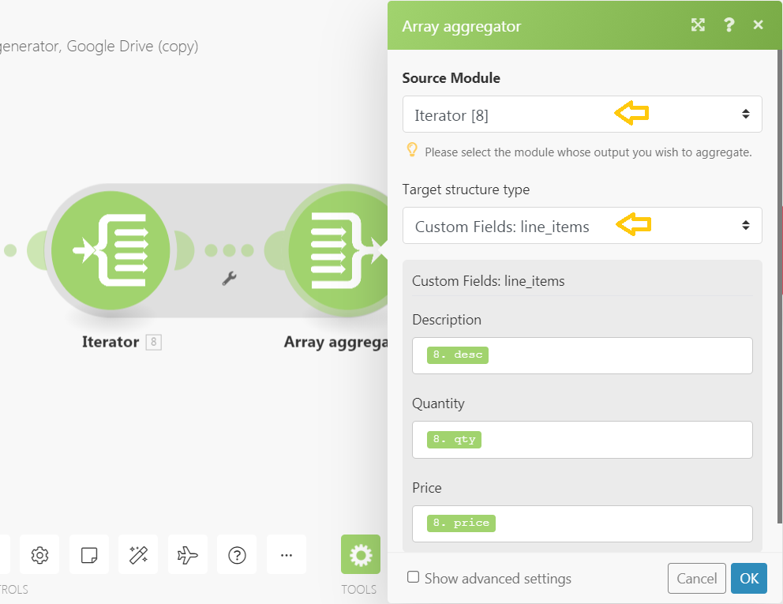
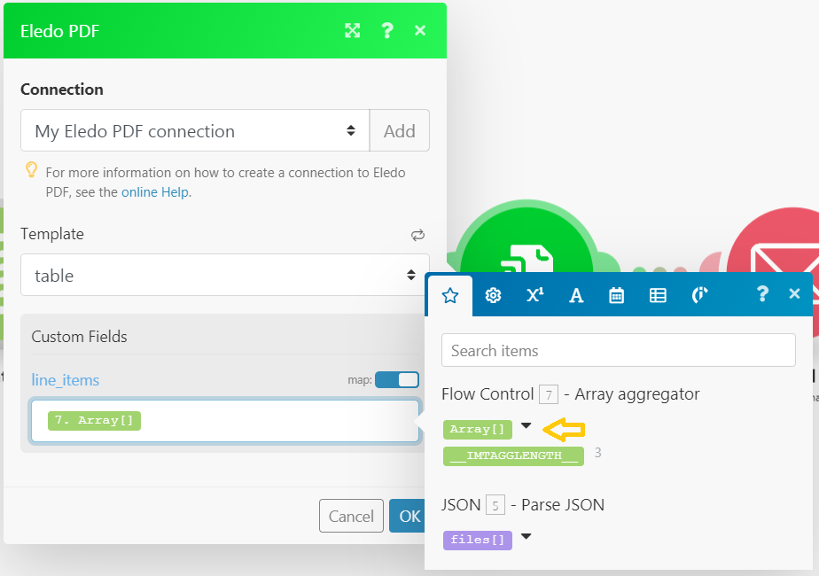

# Eledo PDF with Line Items from Make Array

Many document types like **Invoices** or **Orders** contain one or more **line items** of goods or services.

<!-- truncate -->

A simple way to print the line items table would be to create a table with many rows and populate only some of them. Unfortunately, tables with empty rows do not look good and preparing such templates takes unnecessary time.

Eledo provides an **elegant solution** that is simple, powerful, and prints the exact number of rows needed.

---

## Eledo Template

Insert a **table with two rows and multiple columns**.



Populate the **first row with table headers**.

Move the cursor to the **second row** and click **Block Repetition**.



The selected block will initially be **Table Cell**. Since we want to repeat the **entire row**, click **Select parent Block** to change it.

Then populate the **Data expression** with:

```
line_items
```

Confirm the configuration with **OK**.



The row will become **yellow**, indicating it is a repeating block.

Now insert **Text Boxes** into the row.

Place the cursor in the first cell and click **Table Box**. Populate the **Data expressions** with line item fields and confirm. Repeat the process for each column.



The **last column** usually contains the **line total**, which we can calculate directly in the Eledo template.

A simple expression could be:

```
Quantity * Price
```

However, totals are usually **rounded and formatted with two decimal places**, so we recommend using:

```
CURR(ROUND(Quantity * Price, 2), 0, 2)
```



Save the template and your automation is ready.

---

## Make scenario

Our Eledo template with the **line items array** should look like this:



There are several ways to populate the array.

The most intuitive way might seem to be **Add item** and manually populate the column values. However, this **is not the correct approach**.

If we want a **dynamic number of rows**, we must use the **Map toggle** and populate `line_items` with an **array**.

There are two main approaches.

---

## Easy way

The simplest method is to pass the **entire source array** directly into `line_items`.

This works if the **source array structure matches the structure expected by the Eledo template**.

If the structures do not match, you may see **missing values** in the generated PDF.

In that case, you can adjust the **field names in the Eledo template** so they match your source array structure.

This method works best if you plan your **template structure in advance**.



---

## Advanced configuration

For more advanced scenarios — such as **mapping between arrays** or **combining multiple data sources** — a second method can be used.

This method provides more control but consumes **more Make operations**.

It typically consists of:

- an **Iterator** or **Repeater** module  
- an **Array Aggregator**



The **Iterator** processes your source array.

The key configuration happens in the **Array Aggregator**:

1. Select **Iterator** as the **Source Module**
2. Choose **Eledo line items** as the **Target Structure**
3. Map the fields into the structure expected by your Eledo template



Finally, populate the `line_items` field in the **Eledo module** using the array produced by the **Aggregator**.



Your dynamic line items are now fully configured.