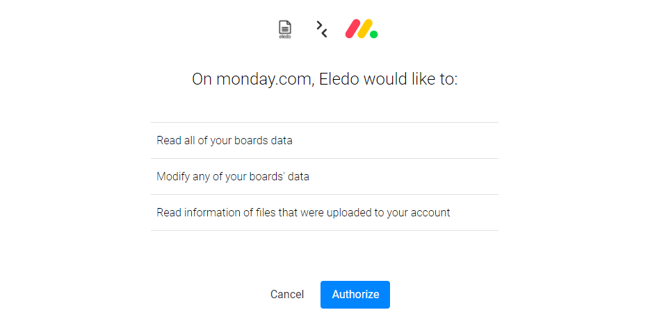
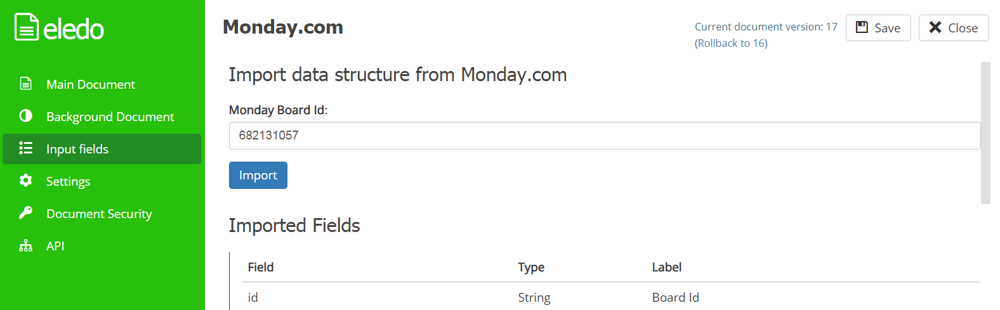
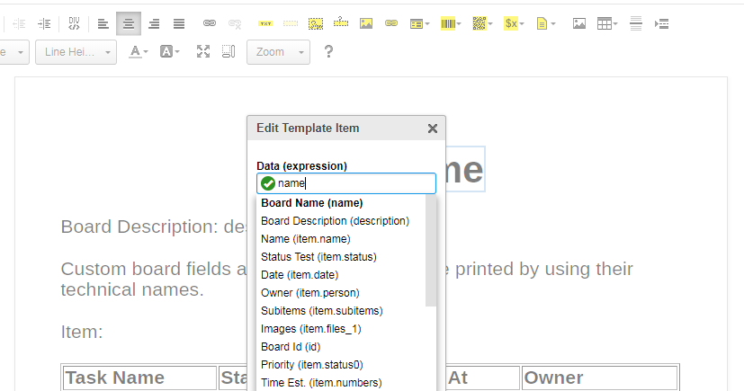
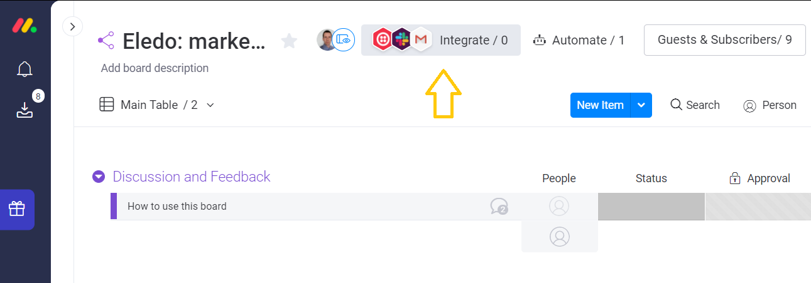
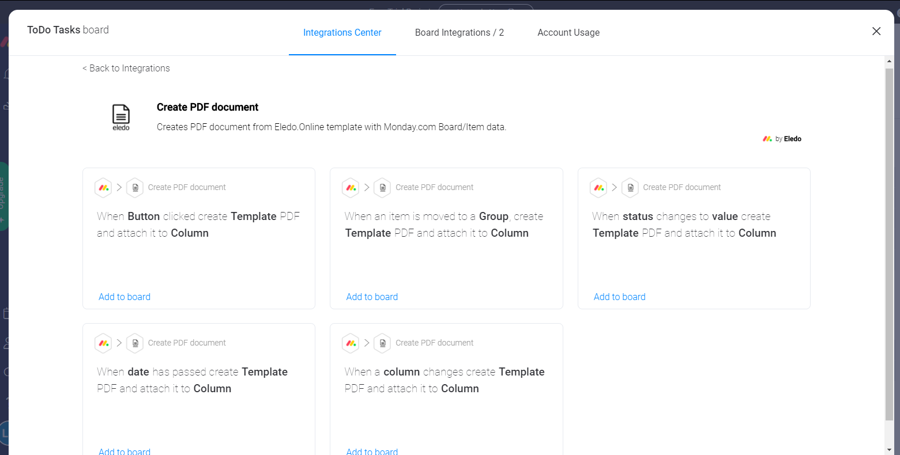
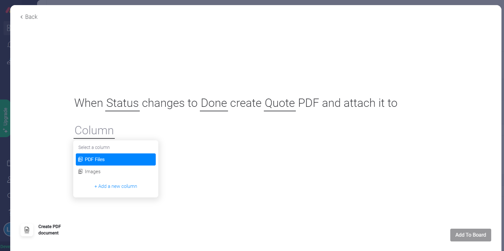
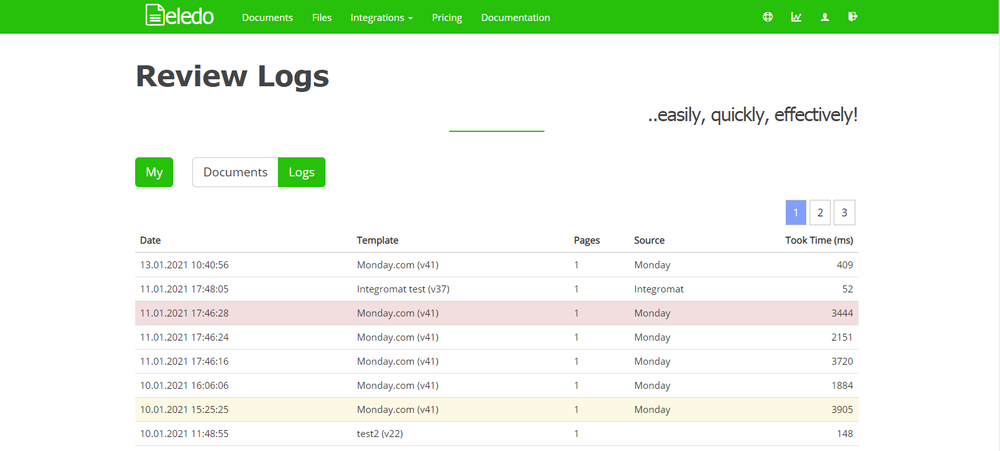

monday.com Boards contain a lot of information about your daily tasks with custom columns. These pieces of information are valuable and in many cases you may want to include them in a document or fill them into a form.

<!-- truncate -->

Eledo makes this possible in an easy and automated way. In this article we will show you how to integrate **Eledo PDF document automation** into your **monday.com Board**.

---

## Adding Eledo into your monday.com Board

You can find the **Eledo App** in the monday.com Marketplace or simply click the button below.

In both cases you will need to authorize the Eledo App to access your board by clicking the **Authorize** button.

This authorization allows Eledo to:

- read your board data and insert them into your PDF document
- write the generated document back to your board
- read assets when image attachments are included

---

## Setting up your Eledo PDF template

With Eledo you can create a **custom PDF document**, or upload a **PDF form** that you want to fill automatically.

In both cases you need to write **data expressions** that tell Eledo which information from your monday.com board should appear in the document.

Data expressions can consist of:

- field names
- functions
- operations that modify the values

To make this easier, you can connect your **Eledo template with your monday.com Board**, and the **expression builder** will help you create the correct expressions.

To connect them you will need to know your **Board ID**.

You can find instructions here:

[Where to find board item and column IDs](https://support.monday.com/hc/en-us/articles/360000225709-Where-to-find-board-item-and-column-IDs)

Then navigate to **Input Fields** in the Eledo template editor, enter your monday.com **Board ID**, and click **Import**.

Field names from your board will appear below as **Imported Fields**, including your custom columns.

The **expression builder** will then provide suggestions for fields that can be used in your template.

Don't forget to **re-import fields** whenever you change columns in your board so the template structure stays up to date.

---

## Setting up monday.com Integration Recipes

Once your document template is ready, you are only one step away from automation.

Choosing **when the document should be generated** is important.

Typically you want the document to be created when:

- task information is complete
- the task needs to be processed further
- the document should be stored as a PDF record

Generating the same document multiple times for one task can unnecessarily consume your **Eledo subscription limits**, so configure your **Recipes** carefully.

You can find Eledo integration recipes directly in your monday.com board.

Click the **Integrate** button and search for **Eledo**.

We have prepared multiple recipes.

After selecting a recipe you will need to complete the sentence configuration.

Click the **underscored words** to configure the recipe parameters. Once everything is set up, the PDF will be generated automatically according to your configuration.

Done! Your automated document creation is now set up.

---

## Error Handling

If everything seems configured but you are not receiving your PDF, the issue is usually related to the **Eledo template configuration**.

Eledo records every PDF generation request as an **event** and creates a **log** entry for it.

Each log contains:

- date and time
- event source
- template used
- document statistics such as page count and generation time

Important: Eledo **does not record transactional data** (the actual request content).

Logs may also include:

- warnings
- errors

These messages can help identify problems with your request.

You can access the logs in Eledo and inspect the **event log details**.

---

## Helpdesk

If something is not working as expected, feel free to contact the **Eledo Helpdesk**.

We hope this automation saves you time and improves your workflow. We would also be happy to hear your feedback.

[Open Eledo Feedback Form](https://eledo.online/feedback)