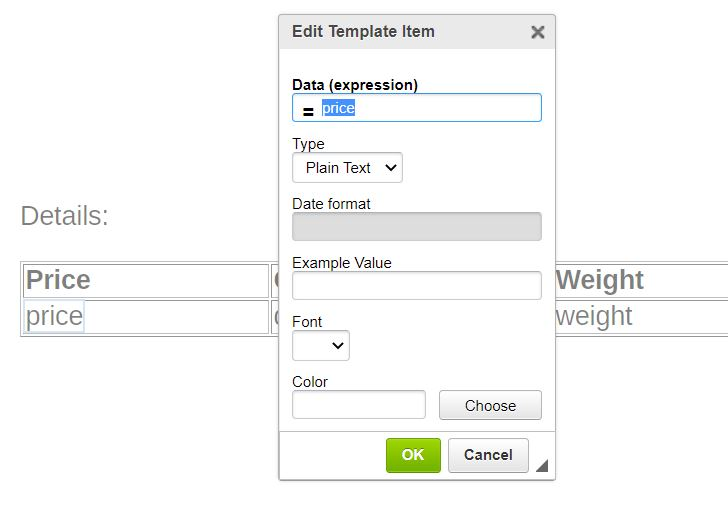
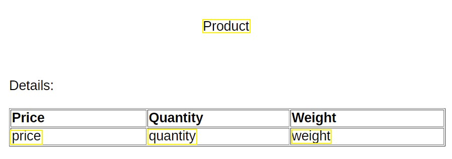
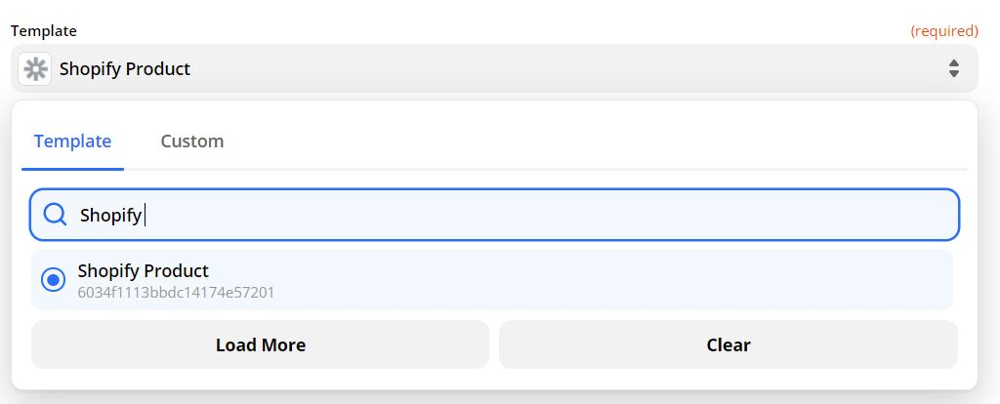
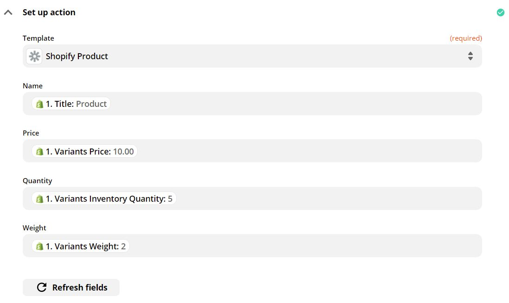
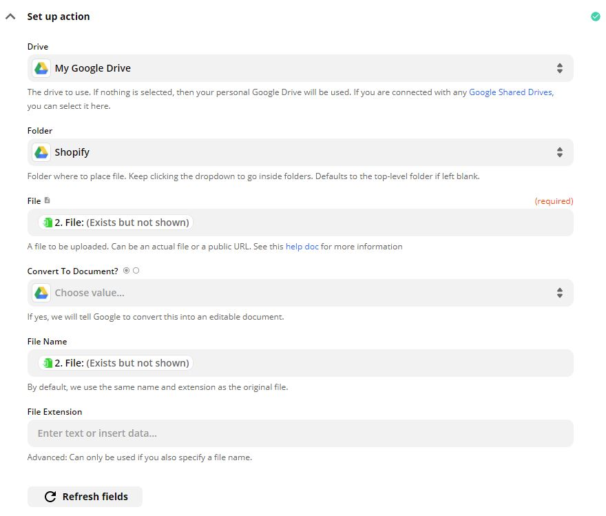
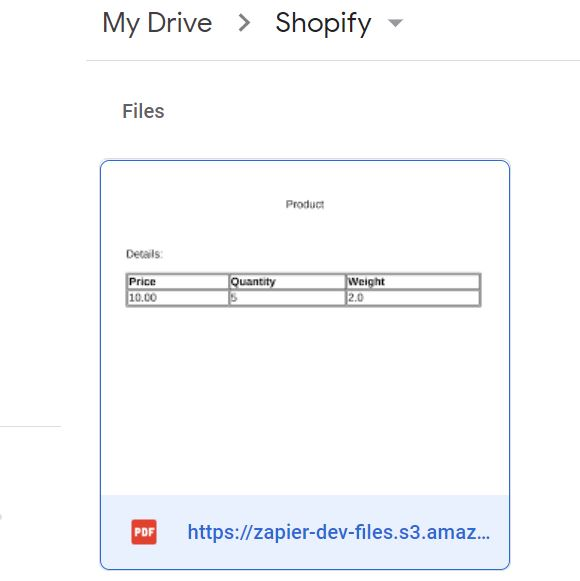

Zapier is an online tool that helps you connect applications and create automated workflows for repetitive processes. In many cases you may want to place important information from these applications into documents.

<!-- truncate -->

With **Eledo**, you can now achieve this in an effective and automated way. In this article we will show how to easily integrate Eledo into your **Zapier workflows (Zaps)**.

---

## Adding Eledo into Zapier

Keep in mind that the Zapier integration is currently in **closed beta**. This means it will not appear in the Zapier public directory yet and you will need an invitation link to access it.

[Follow Zapier invitation](https://zapier.com/platform/public-invite/4355/dae982287a63c5f207759009b71fb949/)

Accept the invite and start building your Zaps with **Eledo**.

---

## Setting Up Your Eledo PDF Template

With Eledo you can:

- create custom **PDF documents**
- upload **PDF forms** that should be automatically filled

In both cases you need to define **data expressions**. These expressions tell Eledo which information from other applications should appear in the generated document.

Data expressions usually consist of:

- field names
- functions
- operations that modify values

In the following example we demonstrate how to prepare a template in Eledo and connect it with **Zapier**.

Let's imagine we want to generate a **PDF product sheet from Shopify** containing attributes such as:

- product name
- price
- quantity
- weight

With Eledo automation, these values can automatically appear in the generated PDF whenever a new product is created in Shopify.

---

### Creating the Template

The first step is creating a **PDF template in Eledo** using text boxes that represent data expressions.

Simply enter the attribute name that should appear in your document.

For example, if you want the **product price** to appear in the document, insert a text box with the corresponding attribute name.

Repeat this process for all attributes you want to include in your document.

In our example we include:

- product name
- price
- quantity
- weight

The final template may look like this:

---

## Building the Zap

Once your template is ready, you can start building your **Zap** in Zapier.

### 1. Choose a Trigger

Select the application where your data originates.

In this example:

- Application: **Shopify**
- Trigger event: **New Product**

---

### 2. Create the Document with Eledo

Add an **Eledo action step** to generate the PDF.

In the **Set up action** section:

- choose the template you created in Eledo  
- in this example we use **Shopify Product**

---

### 3. Map Template Fields

Now connect your template fields with the data coming from Shopify.

In this example we map:

- name
- price
- quantity
- weight

The final mapping configuration should look like this:

---

### 4. Send the Generated PDF

Finally, choose the application where you want to store or send the generated document.

In this example we use **Google Drive**.

When configuring the step, make sure to populate:

- **File**
- **File Name**

using the PDF generated by the Eledo step.

Example configuration:

Once the Zap runs, the generated PDF will automatically appear in your **Google Drive**.

---

## Error Handling

If you configured everything but the PDF is not generated, the issue is often related to the **Eledo template configuration**.

Eledo records every PDF generation request as an **event** and stores a **log** entry.

Each log includes:

- date and time
- event source
- template used
- statistics such as page count and generation time

Important: Eledo **does not record transactional data** (the actual content of the request).

Logs may also contain **warnings** and **errors** that help identify the issue.

You can view these logs in the Eledo dashboard.

---

## Helpdesk

If something is not working as expected, feel free to contact the **Eledo Helpdesk**.

We hope this automation will save you a lot of time. We will also appreciate your feedback.

[Open Eledo Feedback Form](https://eledo.online/feedback)