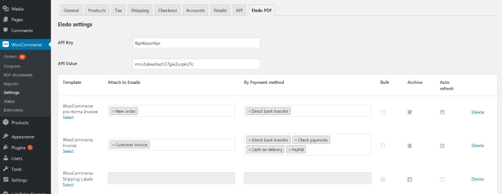
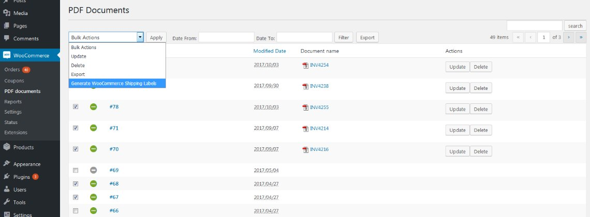

Preparing a simple **label** is easy, but when it comes to large numbers it can take a lot of time. Is there a quick and easy way to automate this?

<!-- truncate -->

At first you should have some data store of your **orders** to provide ongoing automation digital data in a good shape. Then you need some **template** for your label, ideally customizable. Thanks to modern integration tools it should be easy to build a bridge between your order source and a label generator.

As **Eledo** is a document generation service, let's find out how you can use it.

---

## 1. Shipping Labels for WooCommerce

WooCommerce is a popular e-commerce platform and it's also open source, which helped us prepare a native plugin for integration. You can download it from the WordPress public plugin directory or from our webpage. Once installed, a quick configuration gets it working.

The public document **"Shipping Labels for WooCommerce"** was created for this purpose. It has a basic structure and is designed for **A5** size.

Because we are talking about automation, **4 labels** are placed on an **A4** paper sheet so you can print them in **bulk** and then cut them to size.

Navigate to the **PDF Documents** section, where you can select multiple orders and execute a **bulk PDF generation** operation from the **Action** menu. When you receive the PDF, print it as usual.

If you are not happy with the **label design**, don't worry. Our service makes it **possible to personalize** the document template. From simple font size or color changes to more advanced styling techniques **via CSS**.

Feel free to add a logo or decoration image anywhere to make your labels more distinctive. Copy the public document and be creative.

*(picture of copying public document)*

---

## 2. Automation with Zapier

Zapier is an online tool that connects your favorite apps and automates repetitive tasks without coding or relying on developers to build integrations. Our service is integrated with Zapier as well, so you can take advantage of these capabilities.

An interesting implementation can be found in their [blog article](https://zapier.com/blog/print-shipping-labels/#automate). It describes how to print labels automatically every time, without needing to click anything.

The workflow collects labels into a queue and prints them once **four labels** have been gathered.

---

## 3. Your Own Implementation

We provide a **PDF generation service** with basic document templates. You can customize the template, but you can also use the **REST API** to generate your document programmatically.

Find more details about the API in the documentation and implement your own solution.

---

## Barcodes

The public document also contains a **barcode** at the bottom.

To make it work you need to provide a valid value from your data source. You can also:

- replace it with a **QR code**
- use another type of code
- remove it completely if you do not need it